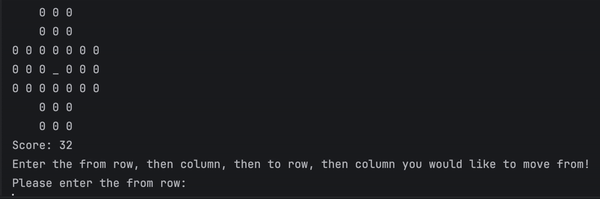

# Marble-Solitaire

  

Welcome to the Marble Solitaire Game! This project is a rendition of the classic <a href=https://www.webgamesonline.com/peg-solitaire/>Peg Solitaire</a> game,
that was played with pegs on a wooden board when it first originated. The goal of the game is to clear all of the marbles on the board through moving each piece over another, effectively "deleting" that marble. The marbles, represented by the enum class with three SlotStates, invalid, empty, and marble, can be set in three different modes, triangular, european, and the classic english solitaire. This project uses the Model-View-Controller (MVC) design pattern which allowed for object oriented programing, easier board abstraction, and a clear UI for the players. To start the game, ENJOY!

<h2 align="center">How To Play</h2>

Using Run Configurations:

You must pass one of english, european, or triangular. This argument will decide which board shape (and hence which model and view) you should use.

You may optionally pass the two arguments -size N, where N is a number, to specify the size of the board. If unspecified, you should use the default size for the chosen board shape.

You may optionally pass the three arguments -hole R C, where R and C are numbers, to specify the row and column of the initial hole in the same manner as players of the game enter move positions. If unspecified, you should use the default hole position for the chosen board shape.

## ‼️Disclaimer‼️

This code is not to be used for college assignments. The code is uploaded to my github as part of my portfolio, but as you all know, this code may not be used as plagiarism and I do not conde any acts made through the **theft** of this code. Other than that though, enjoy!
